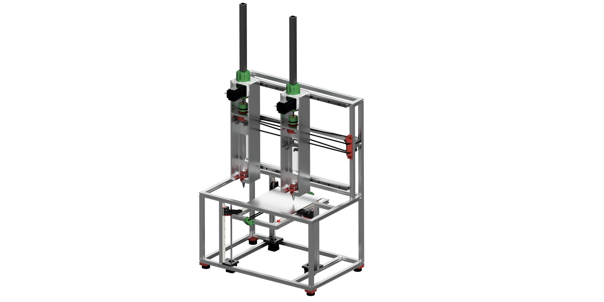

# BEAVER, Biotic 3D Printer - README
## Biotic Extruder for Additive Volumetric Engineering and Research

## Overview
BEAVER is an open-source syringe-based dual-extruder FDM 3D Printer that uses natural biotic material feedstock such as pectin, chitosan, and cellulose. Unlike traditional FDM printers that rely on thermoplastics, this printer deposits viscous biocomposites that dry over time. This project aims to enable accessible research and development in sustainable, bio-based manufacturing.

## Repository Organization
This repository is structured as follows:

### 1. **CAD/**
   - Contains the full printer assembly files in Autodesk Fusion format.
   - Includes individual component models and assemblies.

### 2. **BOM/**
   - Excel spreadsheet listing all required components.
   - Includes part, quantities, and linked sources.

### 3. **Slicer Profile/**
   - PrusaSlicer profile tailored for BEAVER.
   - Post-processing script for altering sliced files for dual-extruder printing.

### 4. **RepRap Config/**
   - `config.zip`: Contains all necessary configuration files for RepRapFirmware on the Duet 3 6HC.
   - `macros.zip`: Collection of macros for printer calibration and workflow.

## Getting Started
1. **Hardware Setup:**
   - Assemble the printer according to the CAD files.
   - Ensure all mechanical components are properly installed and secured.
   - The frame is assembled used blind joints.

2. **Electronics & Firmware:**
   - Set up the Duet 3 Main Board 6HC in SBC mode with the Raspberry Pi and Duet 3 Expansion Board 3HC according to the Duet start up guide.
   - Extract the contents of `RepRap Config/config.zip` and upload them in the Duet Web Control page.
   - Load macros from `macros.zip` for Z-offset calibration and operation.

3. **Slicing & Printing:**
   - Install PrusaSlicer and import the provided profile.
   - Adjust slicing settings based on the material being printed.
   - Generate G-code and upload it to the Duet Web Control interface.
   - For dual material printer, upload the post-processor according to PrusaSlicer instructions.

## Notes
- This project fully functioning, any future updates will continue to be upload here.
- Contributions and improvements from the community are welcome!

## Last Updated:
1/29/2025

## License
This project is licensed under the Creative Commons Attribution-NonCommercial-NoDerivs (CC BY-NC-ND) license. This means you are free to share the material with proper attribution, but you may not use it for commercial purposes or create derivative works.

